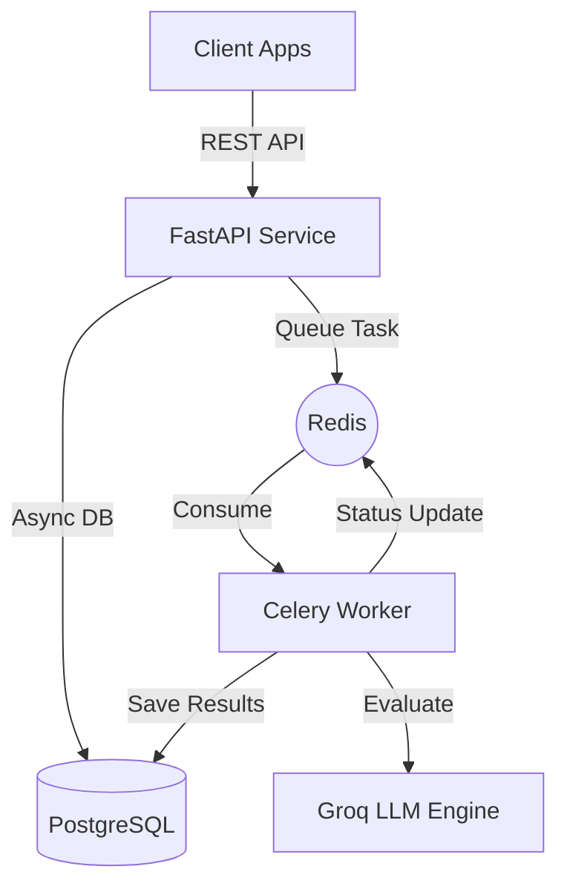

# RAG Evaluation Harness

A high-performance, standalone evaluation service for Retrieval-Augmented Generation (RAG) systems. Built with a modern asynchronous architecture to provide scalable, automated, and multi-tenant "LLM-as-a-Judge" metrics.

## 🚀 Architectural Overview

This project is engineered to solve the bottleneck of evaluating RAG pipelines at scale. By decoupling the API from the heavy lifting of LLM evaluations, it ensures high availability and reliable background processing.

- **API Layer:** FastAPI (Asynchronous) providing high-throughput endpoints.
- **Task Orchestration:** Celery + Redis for reliable background execution of LLM evaluation tasks.
- **LLM Engine:** Groq (Llama 3.1 70B/8B) integration for low-latency, high-accuracy "LLM-as-a-Judge" results.
- **Data Persistence:** PostgreSQL with SQLAlchemy 2.0 (Async) for optimized I/O.
- **Containerization:** Fully orchestrated via Docker & Docker Compose for seamless environment parity.

---

## 🛠️ Technical Key Features

### 1. Asynchronous Task Processing
Evaluations of large datasets can take minutes. This harness utilizes a **Producer-Consumer pattern**:
- The API accepts batch requests and immediately returns a `run_id`.
- Celery workers consume tasks from Redis, managing retries, rate-limiting (exponential backoff), and concurrency control.
- Parallel processing of individual items within a batch via `asyncio.gather` and Semaphores to maximize throughput without hitting LLM rate limits.

### 2. Multi-Tenant Architecture
Designed for multi-user environments with strict data isolation:
- Tenant-based API key authentication.
- Scoped data access for Evaluation Runs, Items, and Metrics.
- Customizable metric definitions per tenant.

### 3. LLM-as-a-Judge Strategy
Implements sophisticated evaluation metrics using custom prompt engineering:
- **Faithfulness:** Does the response only use the provided context?
- **Correctness:** How well does the response match the ground truth?
- **Custom Metrics:** Highly configurable via the `/metrics` API, allowing tenants to define their own scoring logic and prompt templates.

### 4. Robust Database Schema
Utilizes a normalized PostgreSQL schema with:
- **Eager Loading:** Optimized queries using SQLAlchemy `selectinload` to prevent N+1 issues.
- **JSONB Storage:** Flexible storage for metadata and LLM-generated details/reasoning.
- **Alembic Migrations:** Precise version control for the database schema.

---

## 🏗️ System Architecture Diagram



---

## ⚙️ Tech Stack

- **Backend:** Python 3.10+, FastAPI
- **Concurrency:** Celery, Redis, asyncio
- **Database:** PostgreSQL, SQLAlchemy (Async), Alembic
- **LLM Integration:** Groq SDK, Jinja2 (Prompt Templating)
- **Validation:** Pydantic V2
- **Infrastructure:** Docker, Docker Compose

---

## 🚦 Getting Started

### Prerequisites
- Docker & Docker Compose
- Groq API Key

### Installation

1. **Environment Setup:**
   ```bash
   cp .env.example .env
   # Edit .env and add your GROQ_API_KEY
   ```

2. **Spin Up Infrastructure:**
   ```bash
   docker-compose -f docker/docker-compose.yml --env-file .env up --build -d
   ```

3. **Initialize Database:**
   ```bash
   docker-compose -f docker/docker-compose.yml exec api alembic upgrade head
   docker-compose -f docker/docker-compose.yml exec api python -m app.seed
   ```

### Default Credentials (Seed)
- **Tenant:** `dev`
- **API Key:** `dev-api-key-12345` (Pass via `X-API-Key` header)

---

## 📖 API Documentation

The interactive Swagger UI is available at `http://localhost:8000/docs`.

### Key Endpoints:
- `POST /api/v1/evaluate`: Trigger a batch evaluation (Async).
- `GET /api/v1/evaluations/{run_id}`: Poll for results and summary metrics.
- `GET /api/v1/metrics`: List available evaluation metrics.
- `GET /api/v1/comparisons`: Aggregate performance across different runs.

---

## 💎 Engineering Focus

This project goes beyond basic LLM integration, focusing on the engineering challenges of production-grade AI systems:
- **Resilient Architecture:** Strict separation of concerns between API endpoints, background service layers, and distributed task workers.
- **High-Throughput Concurrency:** Leveraging `asyncio` and `Celery` to manage long-running LLM evaluations without blocking the main application flow.
- **Operational Reliability:** Implementation of robust error handling, rate-limit management (exponential backoff), and database transaction integrity.
- **Production Readiness:** A complete lifecycle approach including database migrations (Alembic), containerized orchestration (Docker), and automated environment seeding.
